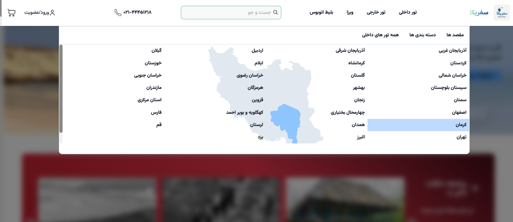
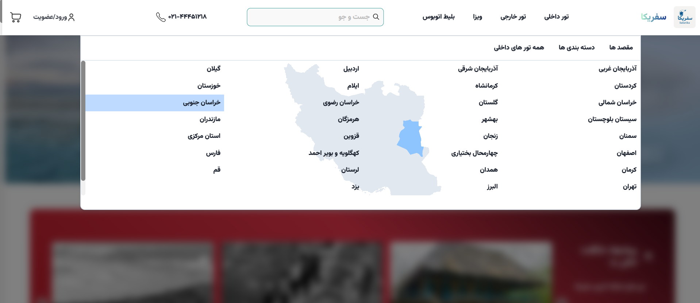
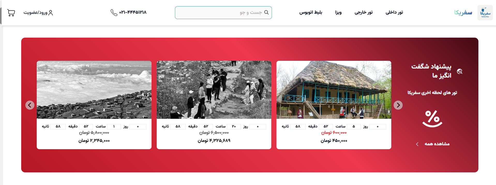
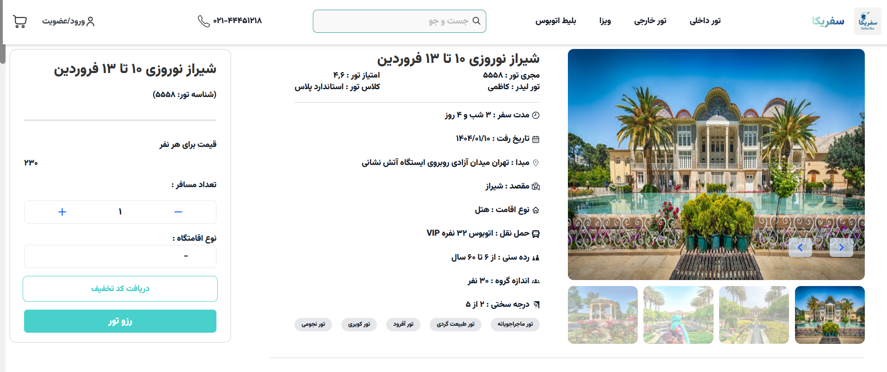
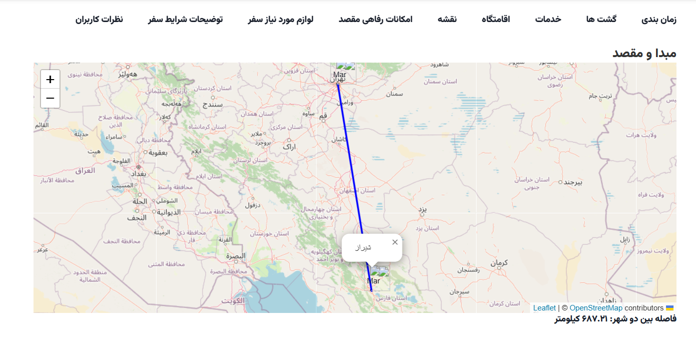

# 🧭 Next-Safarika

Next-Safarika is a modern web application built with [Next.js](https://nextjs.org/) using the `create-next-app` starter. The project is designed to provide a scalable and organized structure for building high-performance, SEO-friendly React applications.

---

## 🚀 Getting Started

To run this project locally, follow these steps:

### 1. Clone the Repository

```bash
git clone https://github.com/MelikaKhalili/Next-Safarika.git
cd Next-Safarika
```

### 2. Install Dependencies

Use your preferred package manager:

```bash
npm install
# or
yarn install
# or
pnpm install
# or
bun install
```

### 3. Start the Development Server

```bash
npm run dev
# or
yarn dev
# or
pnpm dev
# or
bun dev
```

Open [http://localhost:3000](http://localhost:3000) in your browser to see the result.

---

## 🛠️ Built With

- **Next.js** – The React Framework for Production
- **TypeScript** – Typed JavaScript at Scale
- **Tailwind** – For Styling
- **Chakra-Ui** – Ui Library
- **Redux** – For Manage State
- **React Hook Form** – Form Validition

---

## 🖼️ ScreeenShot








## 📜 License

This project is licensed under the [MIT License](./LICENSE).

---

## 🤝 Contributing

Contributions are welcome! Here's how you can help:

1. Fork the repository
2. Create a feature or fix branch
3. Make your changes
4. Submit a pull request

---

## 🙋‍♀️ Author

**Melika Khalili**  
GitHub: [@MelikaKhalili](https://github.com/MelikaKhalili)

---

## 🌟 Show Your Support

If you like this project, give it a ⭐️ on GitHub – it really helps!
